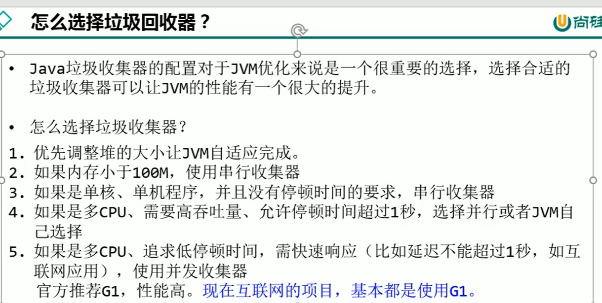

##垃圾回收算法：
###1、引用计数器算法
    因为无法处理循环引用的情况，导致java的垃圾回收器中没有使用这类算法

###2、可达性分析算法

###3、标记清除算法

###4、复制算法

###5、标记压缩算法

###6、分代收集算法

###7、增量收集算法

###引用类型 强软弱虚
    强引用：不回收
    软引用：内存不足OOM即回收
    弱引用：GC时发现即回收
    虚引用：对象回收跟踪，随时可能会被垃圾回收器税收

###评估GC的性能指标

###经典的垃圾回收期

###垃圾回收期与垃圾分代之间的关系

###Serial回收器
    （单线程） 新生代采用复制算法，执行STW，老年代使用标记压缩算法，执行STW
    优势是：简单而高效（与其他收集器在单线程情况下对比）

###ParNew回收器
    ParNew回收器是Serial回收器的多线程版本，只能在新生代进行使用
    对于新生代，回收次数比较多，使用并行更加高效，对于老年代，回收次数少，节约资源

###ParallelGC
    ParallelGC适用于吞吐量比较高的应用场景，适用于后台计算比较多，响应速度不是特别的高的
    jdk8默认使用该垃圾回收器

###CMS回收器：低延迟（jdk14删除）
    初始标记阶段：标记出GCRoots能够关联到的对象（stw）
    并发标记阶段：共GCRoots开始遍历整个对象图，耗时较长，但是不用停止用户线程。
    重新标记阶段：修正并发标记期间因用户线程继续运作而导致标记产生变动的那一部分对象的标记记录
    并发清除阶段：清除删除标记阶段判断的已经死亡的对象，释放内存空间。

###G1回收器：区域分代化
    G1目标：在延迟可控的情况下，获得尽可能高的吞吐量

   
###G1垃圾回收过程

    
    
